# gs_usb_x

## 板子图片

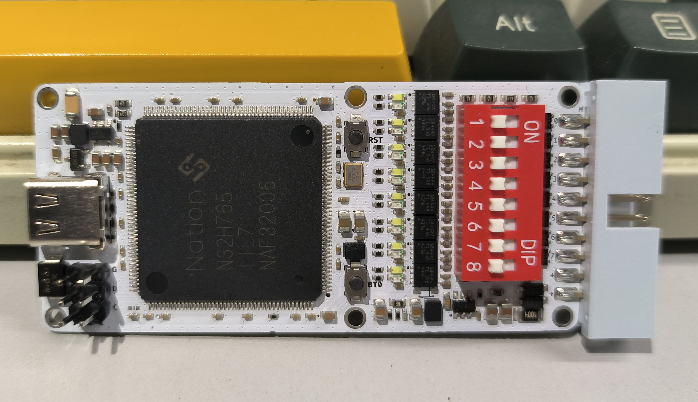

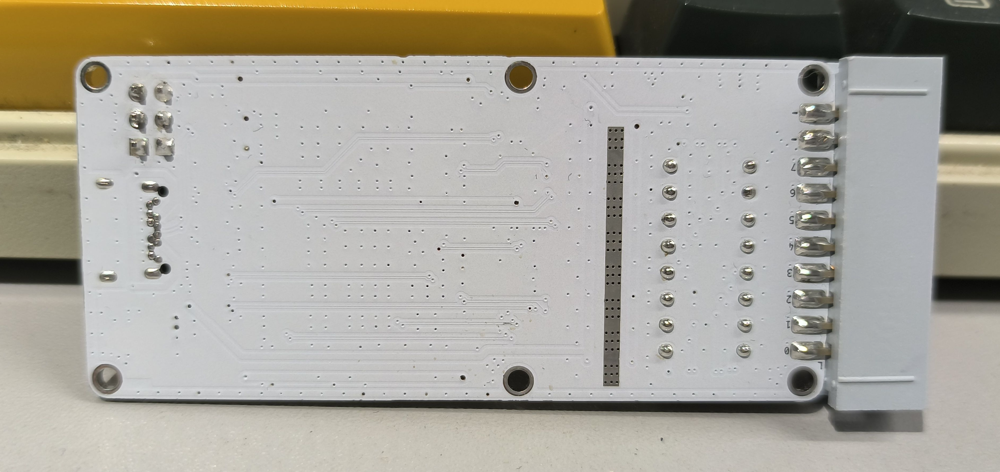

国民技术 N32H765 USB8CANFD板子:

- N32H765IIL7, Cortex-M7, 600MHz, 2MB Flash, 1504KB SRAM, LQFP176  
- USBHS
- 8路CANFD, TI的车规级收发器TCAN1044AVDRBRQ1, 支持8Mbits/s
- 拨码开关可用于开关终端电阻
- 排针引出 SWD 和 调试串口 (G:GND D:DIO C:CLK R:RXD T:TXD V:3V3)
- RESET  和 BOOT 按键
- 支持外部 8-36V 供电
- 引出8个白色和8个红色LED

接口定义:

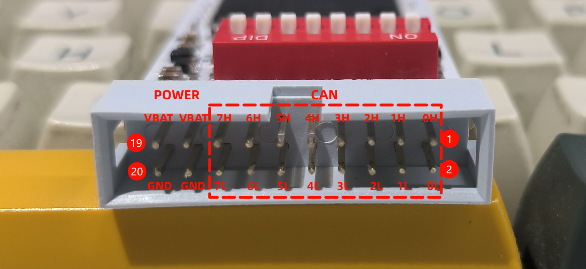

作为学习和评估, 本篇移植了基础的 GS_USB 协议, 并进行了测试, 有想移植其它协议的也可以使用这个板子, 原理图是开源的.

## 参考原理图

[USB8CANFD_N32H765](./sch/N32H765_USB8CANFD_SCH.pdf)

[cherry-embedded/HSCanT-hardware: HSCanT is a USB to 4-channel CAN FD tool designed based on the HPM5321 chip.](https://github.com/cherry-embedded/HSCanT-hardware)


## 固件

### 固件下载

[firmware_n32](./firmware/n32_gs_usb_v1.0.hex)

HSCanT 最新固件在QQ群 975779851 群文件下载.

### N32串口更新方式

[国民技术 下载中心](https://www.nationstech.com/support/down/) 中搜索 `单路量产在线、离线下载工具`, 下载需登录.

按住板子的 BT0 按键, 然后插上USB或连接外部电源给板子上电, 之后可以松开 BT0 按键.

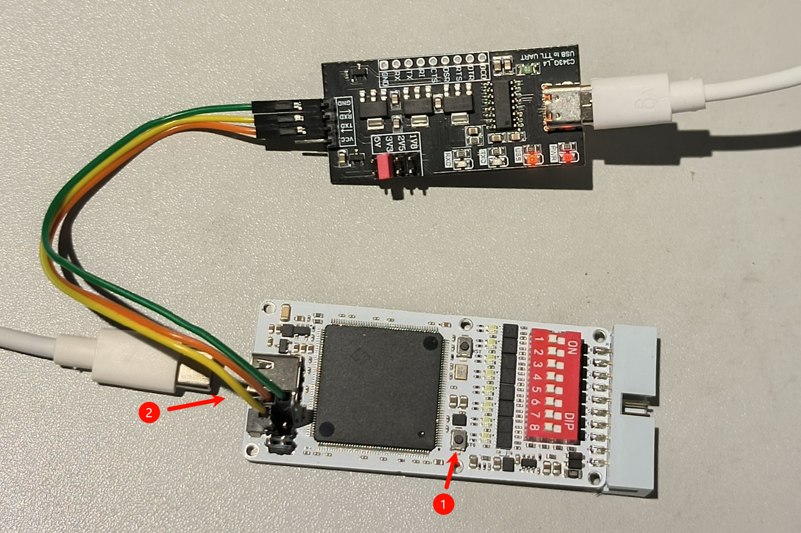

打开 NZDownloadTool.exe, 选择串口, 连接设备, 加载 hex 固件, 下载到 Flash:

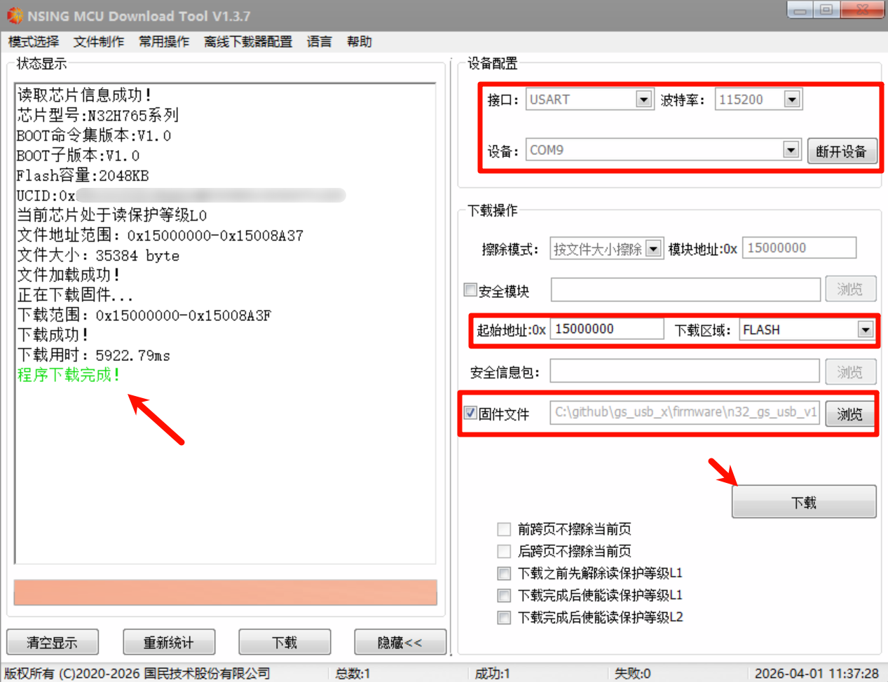

### N32 Jlink 更新方式

N32 Jlink补丁包在 [国民技术 下载中心](https://www.nationstech.com/support/down/) 中搜索 JLink, 参照里面的 `JLink工具添加Nations芯片流程`.

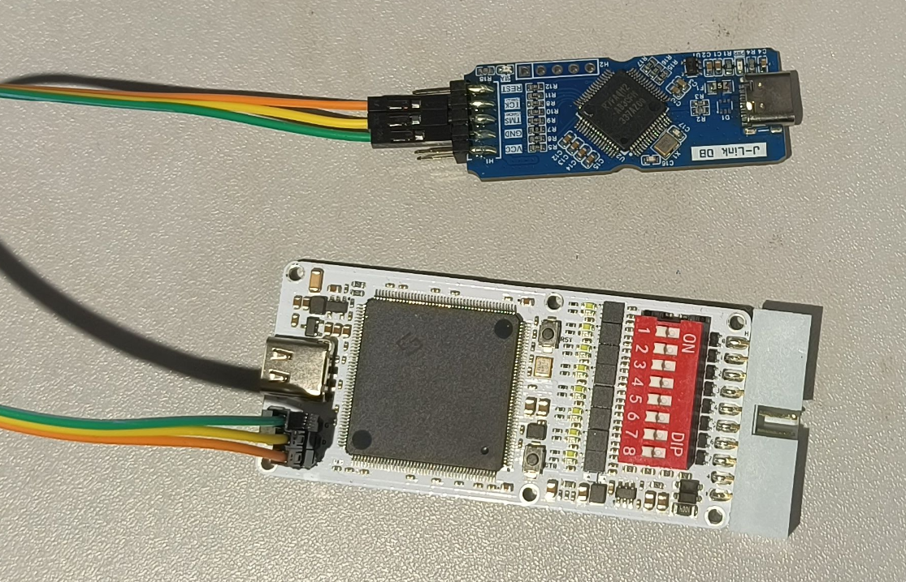

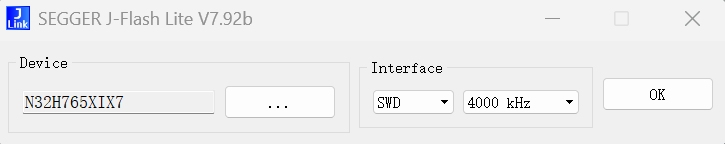

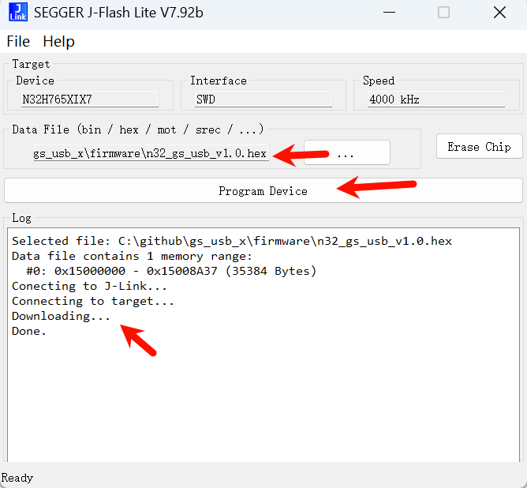

## Linux 测试

### 驱动编译

以 Ubuntu 24.04, Kernel 6.14 为例, 驱动的编译与安装:

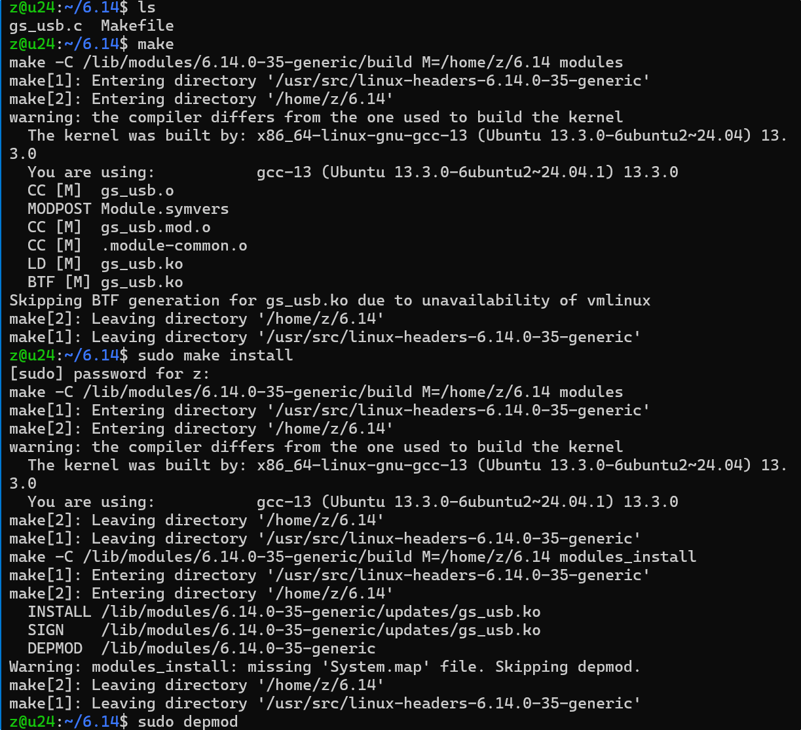

### 位时间设置

插上设备后 dmesg 的显示:

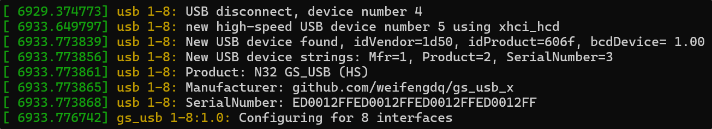

ip link 已经能看到 can0~can7 的设备.

用脚本设置到 仲裁段1M 采样点80% + 数据段5M 采样点75%:

```bash
#!/bin/bash

# 每路参数：iface tq prop-seg phase-seg1 phase-seg2 sjw dtq dprop-seg dphase-seg1 dphase-seg2 dsjw termination
configs=(
    "can0 100 1 6 2 2 25 1 4 2 2 120"
    "can1 100 1 6 2 2 25 1 4 2 2 120"
    "can2 100 1 6 2 2 25 1 4 2 2 120"
    "can3 100 1 6 2 2 25 1 4 2 2 120"
    "can4 100 1 6 2 2 25 1 4 2 2 120"
    "can5 100 1 6 2 2 25 1 4 2 2 120"
    "can6 100 1 6 2 2 25 1 4 2 2 120"
    "can7 100 1 6 2 2 25 1 4 2 2 120"
)

for config in "${configs[@]}"; do
    read -r iface tq prop_seg phase_seg1 phase_seg2 sjw \
        dtq dprop_seg dphase_seg1 dphase_seg2 dsjw termination <<<"${config}"

    echo "配置 ${iface} ..."
    sudo ip link set "${iface}" down

    # tq 单位 ns
    sudo ip link set "${iface}" type can \
        tq "${tq}" \
        prop-seg "${prop_seg}" \
        phase-seg1 "${phase_seg1}" \
        phase-seg2 "${phase_seg2}" \
        sjw "${sjw}" \
        dtq "${dtq}" \
        dprop-seg "${dprop_seg}" \
        dphase-seg1 "${dphase_seg1}" \
        dphase-seg2 "${dphase_seg2}" \
        dsjw "${dsjw}" \
        fd on \
        restart-ms 100

    sudo ip link set "${iface}" mtu 72
    sudo ip link set "${iface}" up
    # sudo ip link set "${iface}" type can termination "${termination}"
    sudo ifconfig "${iface}" txqueuelen 1000

    echo "${iface} 配置完成"
done

echo ""
echo "显示所有CAN接口状态："
for config in "${configs[@]}"; do
    read -r iface _ <<<"${config}"
    echo "=== ${iface} 状态 ==="
    ip -details -s link show "${iface}"
    echo ""
done
```

### 负载率查看

```bash
canbusload can0@1000000,5000000 can1@1000000,5000000 can2@1000000,5000000 can3@1000000,5000000 can4@1000000,5000000 can5@1000000,5000000 can6@1000000,5000000 can7@1000000,5000000 -r -t -b -c
```

用 CAN 分析仪向8路同时发 3000 帧每秒的64字节的FDBRS帧, 帧率和负载率是准确的, 8路合计 24000帧/s

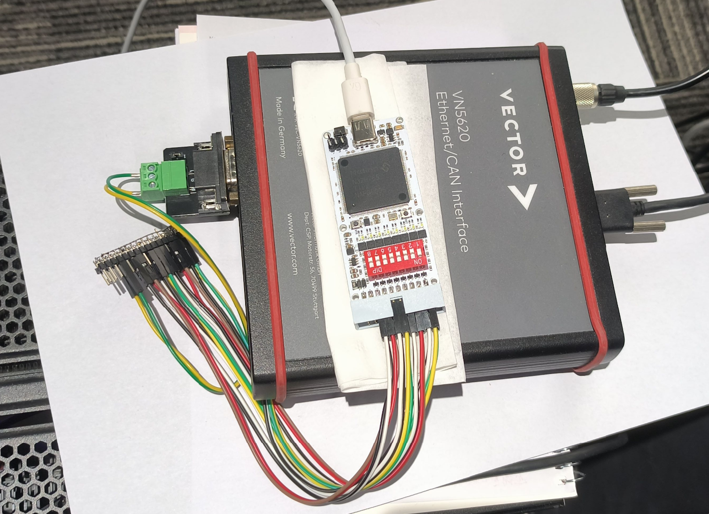

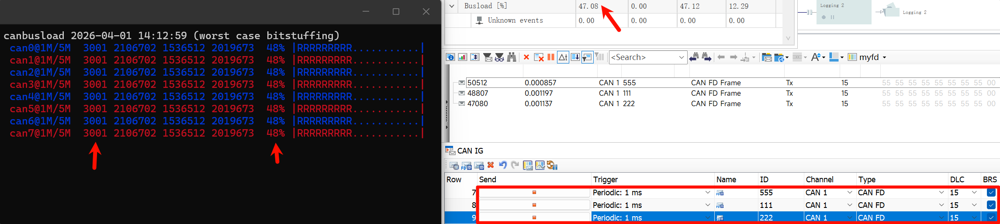

### 录包与查看

```bash
# 所有can录到一个包里
candump -l -r 10485760 any
# 整个包的行数
wc -l candump-2026-04-01_141634.log
# can0 收的帧数
cat candump-2026-04-01_141634.log | grep -c can0
# can0 收的 ID 为 0x555 的帧数
cat candump-2026-04-01_141634.log | grep can0 | grep -c 555#
```

如图, CANoe 以 3000帧/s 的速率发送了 1106333 帧, 8路同时接收, 全录到了, 并且ID 0x555 0x111 0x222 的帧数也能对上

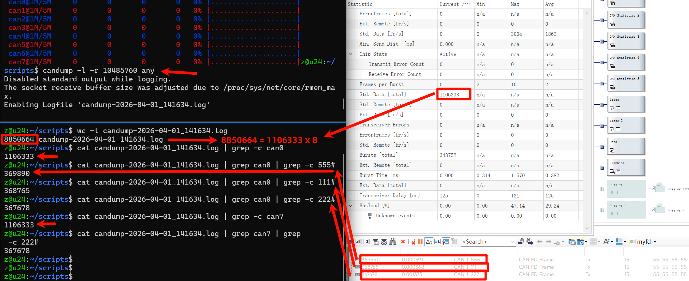

### 单路测试

CANoe 单接 CAN7

6694帧/s, FDBRS, 64B, 100%负载率:

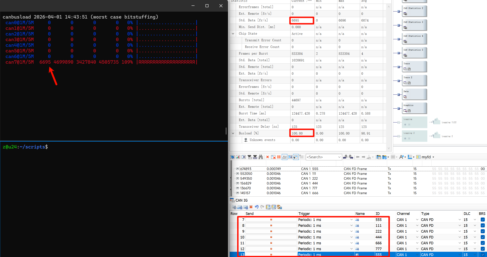

27933帧/s, FDBRS, 0x555, 0B, 100%负载率

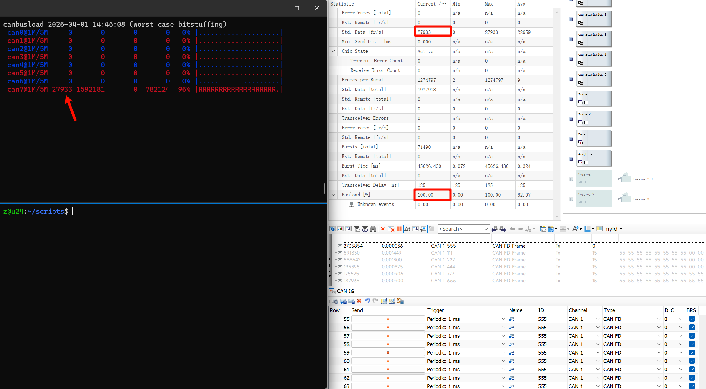

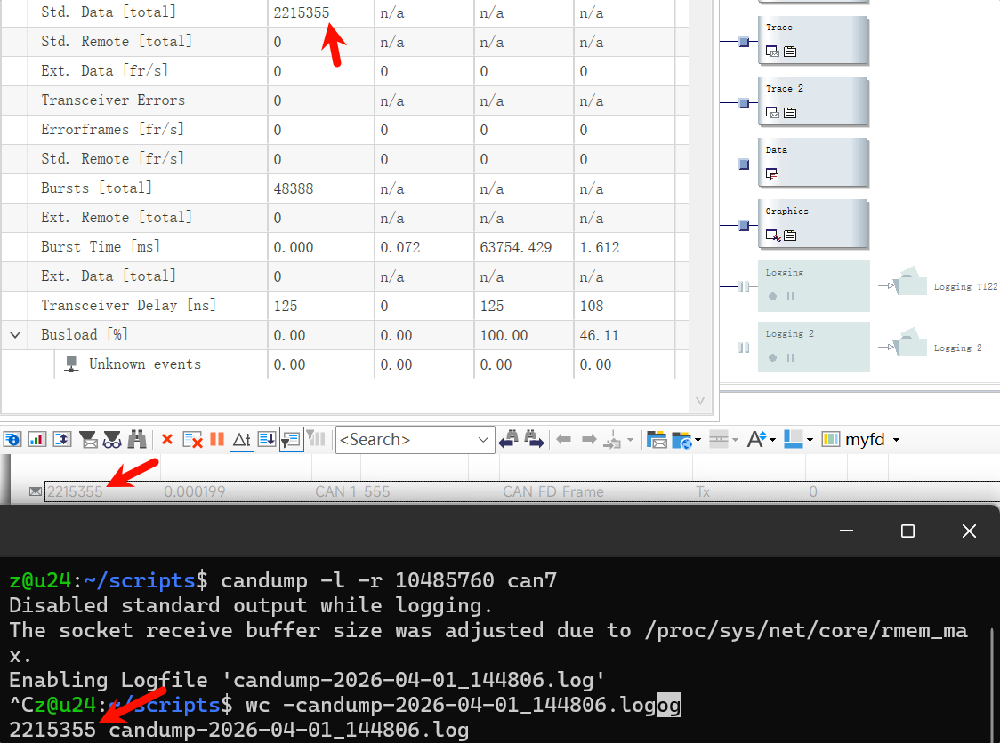

发送

```bash
# 能发出 0x555 64B 约 6300 帧/s, 99% 负载
cangen can7 -g 0.095 -I 555 -L 64 -D i -b

# 能发出 0x555 1B 约 16000 帧/s, 60% 负载
cangen can7 -g 0.002 -I 555 -L 1 -D i -b
```

多路并不会比单路好太多, 峰值应该是 收28000帧/s, 发16000帧/s

### 两两 echo

can0-can1, can2-can3, can4-can5, can6-can7 两两相连

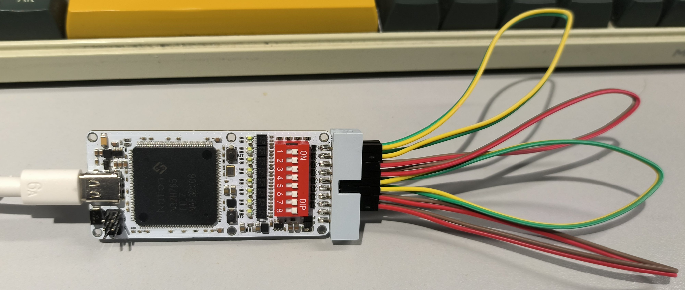

四发四收

```bash
# 约能发出 2130帧/s 0x555 64B FDBRS 
cangen can0 -g 0.4 -I 555 -L 64 -D i -b
cangen can2 -g 0.4 -I 555 -L 64 -D i -b
cangen can4 -g 0.4 -I 555 -L 64 -D i -b
cangen can6 -g 0.4 -I 555 -L 64 -D i -b

canbusload can0@1000000,5000000 can1@1000000,5000000 can2@1000000,5000000 can3@1000000,5000000 can4@1000000,5000000 can5@1000000,5000000 can6@1000000,5000000 can7@1000000,5000000 -r -t -b -c

candump -td -x can0 can1

# 约能发出 2700帧/s 0x555 1B FDBRS 
cangen can0 -g 0.3 -I 555 -L 1 -D i -b
cangen can2 -g 0.3 -I 555 -L 1 -D i -b
cangen can4 -g 0.3 -I 555 -L 1 -D i -b
cangen can6 -g 0.3 -I 555 -L 1 -D i -b
```

如图

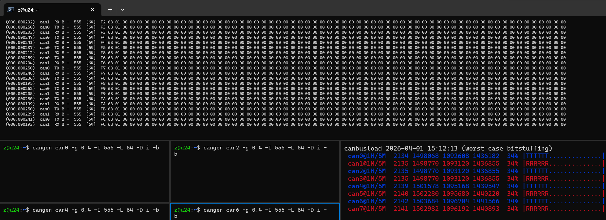

### 错误帧

```bash
# 仅显示错误帧
candump -tA -e -c -a any,0~0,#FFFFFFFF

# 对 can7 短路接地去掉终端电阻等测试 
sudo ip link set can7 down
sudo ip link set can7 up
cansend can7 123#
```

如图

###### 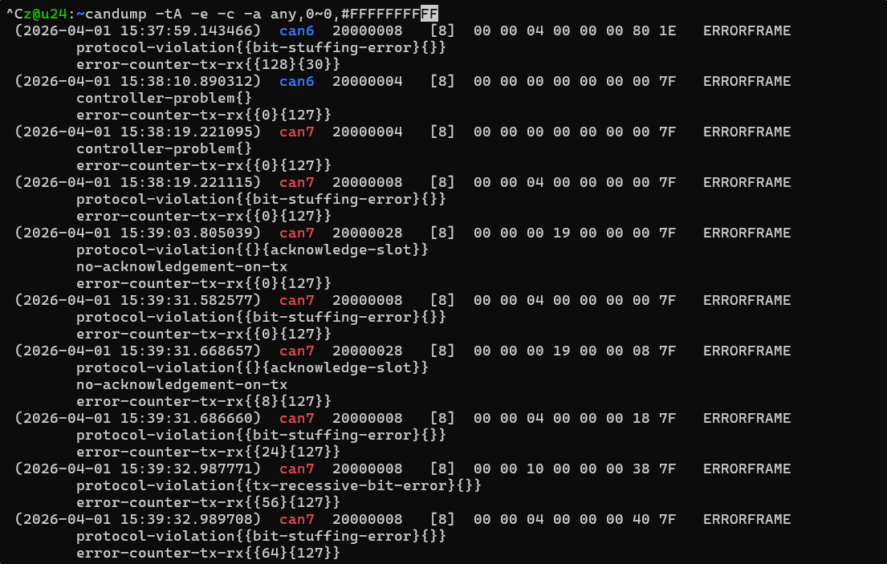


## Win 上位机

峰值性能比 Linux 下差一些, 收24000帧/s, 发13000帧/s, 收周期发送也不太精确, 不过用来快速测试还是不错的


## Win 二次开发


