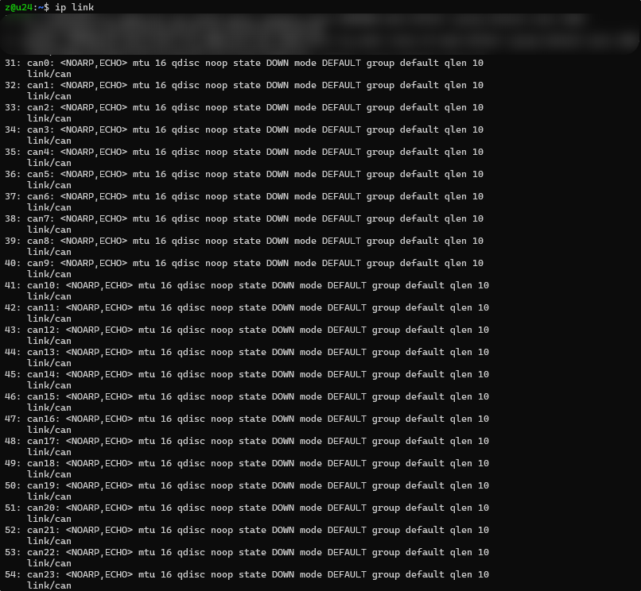
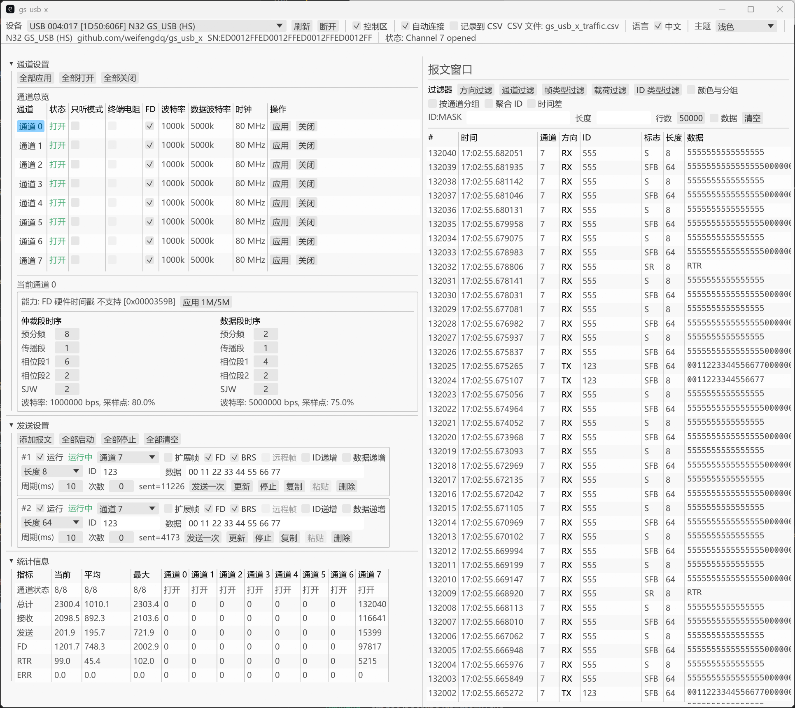

# gs_usb_x

- [gs\_usb\_x](#gs_usb_x)
  - [板子图片](#板子图片)
  - [参考原理图](#参考原理图)
  - [固件](#固件)
    - [固件下载](#固件下载)
    - [N32串口更新方式](#n32串口更新方式)
    - [N32 Jlink 更新方式](#n32-jlink-更新方式)
  - [Linux 测试](#linux-测试)
    - [驱动编译](#驱动编译)
    - [位时间设置](#位时间设置)
    - [负载率查看](#负载率查看)
    - [录包与查看](#录包与查看)
    - [单路测试](#单路测试)
    - [两两 echo](#两两-echo)
    - [错误帧](#错误帧)
    - [多个设备](#多个设备)
  - [Win 上位机](#win-上位机)
  - [Win 二次开发](#win-二次开发)
  - [立创开源平台链接](#立创开源平台链接)
  - [Github 链接](#github-链接)
  - [购买与Q交流群](#购买与q交流群)


## 板子图片


国民技术 N32H765 USB8CANFD板子:

- N32H765IIL7, Cortex-M7, 600MHz, 2MB Flash, 1504KB SRAM, LQFP176  
- USBHS
- 8路CANFD, TI的车规级收发器TCAN1044AVDRBRQ1, 支持8Mbits/s
- 拨码开关可用于开关终端电阻
- 排针引出 SWD 和 调试串口 (G:GND D:DIO C:CLK R:RXD T:TXD V:3V3)
- RESET  和 BOOT 按键
- 支持外部 8-36V 供电
- 引出8个白色和8个红色LED(本篇未使用)

接口定义:


本项目仅作为学习和评估, 移植了基础的 GS_USB 协议, 并进行了测试, 有想移植其它协议的也可以使用这个板子, 原理图是开源的.

## 参考原理图

[N32H765_USB8CANFD_SCH.pdf](https://github.com/weifengdq/gs_usb_x/blob/main/sch/N32H765_USB8CANFD_SCH.pdf)


## 固件

### 固件下载

[firmware_n32_gs_usb](https://github.com/weifengdq/gs_usb_x/tree/main/firmware)


### N32串口更新方式

[国民技术 下载中心](https://www.nationstech.com/support/down/) 中搜索 `单路量产在线、离线下载工具`, 下载需登录.

按住板子的 BT0 按键, 然后插上USB或连接外部电源给板子上电, 之后可以松开 BT0 按键.


打开 NZDownloadTool.exe, 选择串口, 连接设备, 加载 hex 固件, 下载到 Flash:


### N32 Jlink 更新方式

N32 Jlink补丁包在 [国民技术 下载中心](https://www.nationstech.com/support/down/) 中搜索 JLink, 参照里面的 `JLink工具添加Nations芯片流程`.


## Linux 测试

### 驱动编译

以 Ubuntu 24.04, Kernel 6.14 为例, 驱动的编译与安装:


### 位时间设置

插上设备后 dmesg 的显示:


ip link 已经能看到 can0~can7 的设备.

用脚本设置到 仲裁段1M 采样点80% + 数据段5M 采样点75%:

```bash
#!/bin/bash

# 每路参数：iface tq prop-seg phase-seg1 phase-seg2 sjw dtq dprop-seg dphase-seg1 dphase-seg2 dsjw termination
configs=(
    "can0 100 1 6 2 2 25 1 4 2 2 120"
    "can1 100 1 6 2 2 25 1 4 2 2 120"
    "can2 100 1 6 2 2 25 1 4 2 2 120"
    "can3 100 1 6 2 2 25 1 4 2 2 120"
    "can4 100 1 6 2 2 25 1 4 2 2 120"
    "can5 100 1 6 2 2 25 1 4 2 2 120"
    "can6 100 1 6 2 2 25 1 4 2 2 120"
    "can7 100 1 6 2 2 25 1 4 2 2 120"
)

for config in "${configs[@]}"; do
    read -r iface tq prop_seg phase_seg1 phase_seg2 sjw \
        dtq dprop_seg dphase_seg1 dphase_seg2 dsjw termination <<<"${config}"

    echo "配置 ${iface} ..."
    sudo ip link set "${iface}" down

    # tq 单位 ns
    sudo ip link set "${iface}" type can \
        tq "${tq}" \
        prop-seg "${prop_seg}" \
        phase-seg1 "${phase_seg1}" \
        phase-seg2 "${phase_seg2}" \
        sjw "${sjw}" \
        dtq "${dtq}" \
        dprop-seg "${dprop_seg}" \
        dphase-seg1 "${dphase_seg1}" \
        dphase-seg2 "${dphase_seg2}" \
        dsjw "${dsjw}" \
        fd on \
        restart-ms 100

    sudo ip link set "${iface}" mtu 72
    sudo ip link set "${iface}" up
    # sudo ip link set "${iface}" type can termination "${termination}"
    sudo ifconfig "${iface}" txqueuelen 1000

    echo "${iface} 配置完成"
done

echo ""
echo "显示所有CAN接口状态："
for config in "${configs[@]}"; do
    read -r iface _ <<<"${config}"
    echo "=== ${iface} 状态 ==="
    ip -details -s link show "${iface}"
    echo ""
done
```

### 负载率查看

```bash
canbusload can0@1000000,5000000 can1@1000000,5000000 can2@1000000,5000000 can3@1000000,5000000 can4@1000000,5000000 can5@1000000,5000000 can6@1000000,5000000 can7@1000000,5000000 -r -t -b -c
```

用 CAN 分析仪向8路同时发 3000 帧每秒的64字节的FDBRS帧, 帧率和负载率是准确的, 8路合计 24000帧/s


### 录包与查看

```bash
# 所有can录到一个包里
candump -l -r 10485760 any
# 整个包的行数
wc -l candump-2026-04-01_141634.log
# can0 收的帧数
cat candump-2026-04-01_141634.log | grep -c can0
# can0 收的 ID 为 0x555 的帧数
cat candump-2026-04-01_141634.log | grep can0 | grep -c 555#
```

如图, CANoe 以 3000帧/s 的速率发送了 1106333 帧, 8路同时接收, 全录到了, 并且ID 0x555 0x111 0x222 的帧数也能对上


### 单路测试

CANoe 单接 CAN7

6694帧/s, FDBRS, 64B, 100%负载率:


27933帧/s, FDBRS, 0x555, 0B, 100%负载率


发送

```bash
# 能发出 0x555 64B 约 6300 帧/s, 99% 负载
cangen can7 -g 0.095 -I 555 -L 64 -D i -b

# 能发出 0x555 1B 约 16000 帧/s, 60% 负载
cangen can7 -g 0.002 -I 555 -L 1 -D i -b
```

多路并不会比单路好, 合计峰值应该在 收28000帧/s, 发16000帧/s 附近

### 两两 echo

can0-can1, can2-can3, can4-can5, can6-can7 两两相连


四发四收

```bash
# 约能发出 2130帧/s 0x555 64B FDBRS 
cangen can0 -g 0.4 -I 555 -L 64 -D i -b
cangen can2 -g 0.4 -I 555 -L 64 -D i -b
cangen can4 -g 0.4 -I 555 -L 64 -D i -b
cangen can6 -g 0.4 -I 555 -L 64 -D i -b

canbusload can0@1000000,5000000 can1@1000000,5000000 can2@1000000,5000000 can3@1000000,5000000 can4@1000000,5000000 can5@1000000,5000000 can6@1000000,5000000 can7@1000000,5000000 -r -t -b -c

candump -td -x can0 can1

# 约能发出 2700帧/s 0x555 1B FDBRS 
cangen can0 -g 0.3 -I 555 -L 1 -D i -b
cangen can2 -g 0.3 -I 555 -L 1 -D i -b
cangen can4 -g 0.3 -I 555 -L 1 -D i -b
cangen can6 -g 0.3 -I 555 -L 1 -D i -b
```

如图


### 错误帧

```bash
# 仅显示错误帧
candump -tA -e -c -a any,0~0,#FFFFFFFF

# 对 can7 短路 接地 去掉终端电阻 等测试
sudo ip link set can7 down
sudo ip link set can7 up
cansend can7 123#
```

如图


### 多个设备

接3个设备, 对应24路CAN, 是按插入顺序自动编号的 can0~can23, 不用担心冲突问题




## Win 上位机

[gs_usb_x exe](https://github.com/weifengdq/gs_usb_x/tree/main/host)

首次连接可能需要用 Zadig 装一下 WinUSB 驱动.

峰值性能比 Linux 下差一些, 收24000帧/s, 发13000帧/s, 收周期发送也不太精确, 不过用来快速测试还是不错的

标志缩写 S:标准帧 E:扩展帧 R:远程帧 F:FDF B:BRS O:Overflow(可忽略)



## Win 二次开发

[gs_usb_x sdk](https://github.com/weifengdq/gs_usb_x/tree/main/sdk), 给出了 python c++ c# rust 的参考示例.

以 python 为例, 对接到了 python-can:

```bash
cd python-can-gsusb
pip install .
# 安装 python-can 和 pyusb

# 运行示例
> python .\examples\02_periodic.py --gsusb-channel 7
Opening auto Channel 7 @ 1000000bps...
Starting periodic send every 1.0s
...

# 代码示例
```

简单的通道7 1M + 8M 发送示例:

```python
import can
from gsusb import GsUsbBus
bus = GsUsbBus(channel=0, gsusb_channel=7, bitrate=1000000, fd=True, data_bitrate=8000000)
msg = can.Message(arbitration_id=0x123, data=[0x11, 0x22, 0x33, 0x44], is_extended_id=False, is_fd=True, bitrate_switch=True)
bus.send(msg)
bus.shutdown()
```

GsUsbBus 支持的参数

```python
class GsUsbBus(BusABC):
    def __init__(
        self,
        channel: Optional[str] = "auto",
        *,
        gsusb_channel: int = 0,
        bitrate: Optional[int] = None,
        fd: bool = False,
        data_bitrate: Optional[int] = None,
        nominal_timing: Optional[object] = None,
        data_timing: Optional[object] = None,
        listen_only: bool = False,
        termination_enabled: bool = True,
        vendor_id: int = DEFAULT_VENDOR_ID,
        product_id: int = DEFAULT_PRODUCT_ID,
        interface_number: Optional[int] = None,
        serial_number: Optional[str] = None,
        **kwargs,
    )
```


## 立创开源平台链接

[N32H765 USB8CANFD - 立创开源硬件平台](https://oshwhub.com/weifengdq/project_cjqotmtf)

## Github 链接

[weifengdq/gs_usb_x](https://github.com/weifengdq/gs_usb_x):

- firmware: hex 固件
- host: win 上位机
- kernel: linux kernel module, scripts 里面是设置的示例脚本
- sch: 原理图
- sdk: win 二次开发参考

## 购买与Q交流群

【闲鱼】https://m.tb.cn/h.ijsGJPw?tk=P1EI523r95G HU926 「我在闲鱼发布了【国民技术 N32H765 USB 8路CANFD板子:】」 点击链接直接打开

QQ 交流群: 1040239879